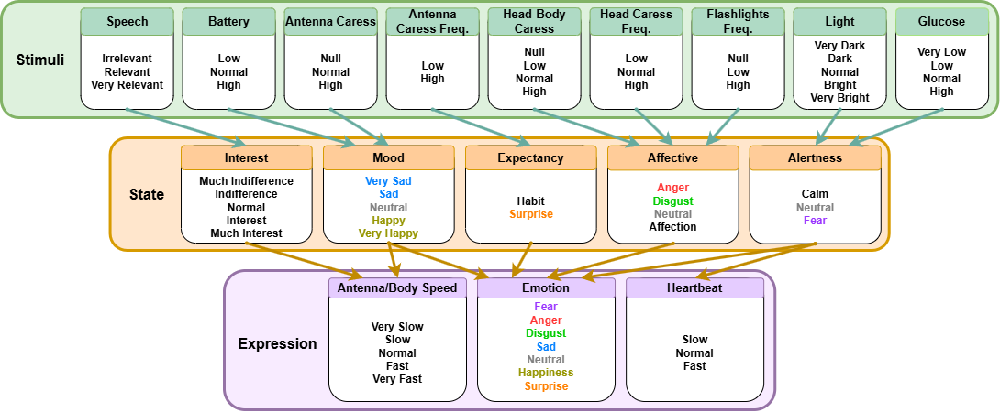

# Emotional Model FLS

A public-safe fuzzy-logic framework for building customizable emotional models.

This repository publishes the runtime, fuzzy engine, configuration loader and a
synthetic toy model. It does not publish the private rule tables or calibrated
membership functions used by the original model.



## What Is Included

```text
.
├── src/emotional_model_fls/        Python package
│   ├── fuzzy_engine.py             Reusable scikit-fuzzy builders
│   ├── config_loader.py            Config-to-spec loader
│   ├── example_specs.py            Synthetic demo specs
│   ├── example_specs.yaml          Packaged demo config
│   ├── runtime.py                  High-level runtime API
│   └── cli.py                      Command-line interface
├── examples/
│   └── toy_emotional_model.yaml    Editable demo model config
├── docs/
│   ├── how_to_build_your_model.md
│   ├── architecture.md
│   ├── model_architecture.png
│   └── ray_emotional_model.pdf     Public architecture diagram
└── tests/
```

## What Is Not Included

The public repository intentionally excludes:

- Real fuzzy rule tables.
- Real membership-function calibration values.
- Spreadsheet sources such as `emotional_model_fuzzy_logic_rules_v5.xlsx`.
- Private experiment scripts and real experiment outputs.
- Generated plots from the private model.

The demo model is useful for development and integration tests, but it is not
the original emotional model.

## Install

```bash
python -m venv .venv
. .venv/bin/activate
python -m pip install -e ".[dev]"
```

For normal YAML files, install the optional config dependency:

```bash
python -m pip install -e ".[config]"
```

The bundled example file is JSON-compatible YAML, so it also works without
PyYAML.

## Run

Use the packaged demo specs:

```bash
emotional-model-fls --steps 1 --no-json
```

Use your own config:

```bash
emotional-model-fls --config examples/toy_emotional_model.yaml --steps 1 --no-json
```

Run as a module:

```bash
python -m emotional_model_fls --steps 1
```

## Python API

```python
from emotional_model_fls.runtime import EmotionalModel, SensorInputs

model = EmotionalModel(config_path="examples/toy_emotional_model.yaml")
outputs = model.step(SensorInputs(speech=8, battery=12))

print(outputs.general_state, outputs.heartbeat, outputs.body_speed)
```

## Build Your Own Model

Start from `examples/toy_emotional_model.yaml` and replace:

- `variables`: universes and membership functions for your sensors, internal
  states and expressions.
- `input_aliases`: feedback inputs such as `_mood` or `_alertness`.
- `rules`: rule sets using either compact `default` + `overrides`, explicit
  `items`, or a full nested `table`.

See `docs/how_to_build_your_model.md` for the full config format.

## Tests

```bash
ruff check . --no-cache
pytest -q
```

## Privacy Note

If you maintain a private calibrated model, keep it outside this public repo.
Publishing a `.gitignore` is not enough after a file has been committed. Build
the public repository first, verify it contains only demo data, and then create
the first Git commit.
